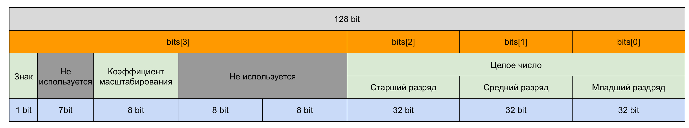

# s21_decimal ликбез

### Структура заметки
- [Коротко об устройстве decimal чисел](#коротко-об-устройстве-decimal-чисел)
- [Побитовые операции](#побитовые-операции)
- [Какие функции нужны по заданию и их алгоритмы](#функции-для-проекта)


## Коротко об устройстве decimal чисел
Картинка из экселя которая поможет лучше представить как устроены данные в Decimal


Decimal число может быть реализовано в виде четырехэлементного массива 32-разрядных целых чисел со знаком (`int bits[4];`).

`bits[0]`, `bits[1]`, и `bits[2]` содержат младшие, средние и старшие 32 бита 96-разрядного целого числа соответственно.

`bits[3]` содержит коэффициент масштабирования и знак, и состоит из следующих частей:
- Биты от 0 до 15, младшее слово, не используются и должны быть равны нулю.
- Биты с 16 по 23 должны содержать показатель степени от 0 до 28, который указывает степень 10 для разделения целого числа.
- Биты с 24 по 30 не используются и должны быть равны нулю.
- Бит 31 содержит знак; 0 означает положительный, а 1 означает отрицательный.

Обратите внимание, что битовое представление различает отрицательные и положительные нули. Эти значения могут считаться эквивалентными во всех операциях.

### Пример:

```c
typedef struct 
{
    int bits[4];
} s21_decimal;
```

### Расширенный decimal
```c
typedef struct 
{   
    uint64_t bits[7]; // берем 7 безнаковых!! интов по 64 бита для нормальной работы с переполнением
    uint16_t scale;   // отдельно безнаковый!! инт с 16 битами для работы со степенью
} s21_work_decimal;
```

Степень (коэффициент масштабирования) - используется для деления целого числа, которое находится в bits[0], bits[1], bits[2], и указания того, какая его часть является дробью. Степень неявно равна 10 в степени от 0 до 28

### Пример:
Например, представим число 123,3 в двоичном представлении decimal числа
123,3 - это 1233 в степени 10⁻¹

1230₁₀ = 100 11010001₂
1₁₀ = 1₂

целое число: (32 нуля в bits[2]) (32 нуля в bits[1]) (16 нулей + 00000100 11010001 в bits[0])

степень: 00000000 00000001 (еще 16 нулей) в bits[3]

## Побитовые операции
### Сдвиги и побитовые операции
| Операция | Обозначение | Пример |
| -------- | ----------- | ------ |
| Сдвиг влево | << | 0000 1010 << 2 == 0010 1000 |
| Сдвиг вправо | >> | 0000 1010 >> 2 == 0000 0010 | 
| НЕ | ~ | ~0000 1010 == 1111 0101 | 
| И | & | 0000 1010 & 1110 0011 == 0000 0010 |
| ИЛИ | l | 0000 1010 l 1110 0011 == 111 1011 |
| исключающее ИЛИ | ^ | 0000 1010 ^ 1110 0011 == 1111 1001 | 

### Битовые маски
это числа, битовые представления которых мы знаем. Удобнее всего использовать их в качестве макросов

```c
#define MINUS 0x80000000     // 10000000 00000000 00000000 00000000 
#define SCALE 0x00ff0000     // 00000000 11111111 00000000 00000000
#define MAX4BITE 0xffffffff  // 11111111 11111111 11111111 11111111
```

### Примеры: как узнать бит?
- value & mask

В числе 01011101 узнаем, что на месте второго разряда

Сдвинем 1 на 2 влево: 1 << 2 == 00000100 

Применим, полученную маску на число с помощью &

01011101 & 00000100 == 000000100

## Функции для проекта
### Арифметические операторы
- вычитание - это сложение с противоположным знаком
- перед самой операцией обязательно проверить числа на 0 и знаки
- если знаки одинаковые, то конвертируем в work_decimal, складываем модули и 
- если знаки разные, то мы из большего по модулю (s21_is_greater) вычитаем меньшее (~bits[i] комплементарное для вычитания)
- конвертируем обратно в обычный decimal

- позже разберу деление и умножение...

| Название оператора | Оператор  | Функция                                                                            | 
| ------ | ------ |------------------------------------------------------------------------------------|
| Сложение | + | int s21_add(s21_decimal value_1, s21_decimal value_2, s21_decimal *result)         |
| Вычитание | - | int s21_sub(s21_decimal value_1, s21_decimal value_2, s21_decimal *result)         |
| Умножение | * | int s21_mul(s21_decimal value_1, s21_decimal value_2, s21_decimal *result) | 
| Деление | / | int s21_div(s21_decimal value_1, s21_decimal value_2, s21_decimal *result) |

Функции возвращают код ошибки:  
- 0 - OK  
- 1 - число слишком велико или равно бесконечности
- 2 - число слишком мало или равно отрицательной бесконечности
- 3 - деление на 0

*Уточнение про числа, не вмещающиеся в мантиссу:*
- *При получении чисел, не вмещающихся в мантиссу при арифметических операциях, использовать банковское округление (например, 79,228,162,514,264,337,593,543,950,335 - 0.6 = 79,228,162,514,264,337,593,543,950,334)*

### Банковское округление
- Если последнее число НЕ 5, то округляем по стандартным по математическим правилам
- Если последнее число 5, то:
    - если после 5 есть хотя бы один НЕ 0, то увеличиваем
    - если после 5 только 0, то:
        - если до 5 стоит четная цифра, то отбрасываем цифры после
        - если до 5 стоит нечетная цифра, то увеличиваем

| Исходное число | Округленное число |
| -------------- | ----------------- |
| 12,6 | 13 |
| 12,3 | 12 |
| 2,5000001 | 3 |
| 2,5 | 2 |
| 1,5 | 2 |


### Операторы сравнения
- реализованы == и < , потому что остальные - это их комбинация
- после проверки на 0 и знаки, конвертируем в расширенный decimal
- приводим меньшую степень к большей так, чтобы они были равны (pointleft)
- сравниваем bits[i] по циклу начиная со старших разрядов

- обратно можно не ковертировать, потому что просто возвращаем результат

| Название оператора | Оператор  | Функция | 
| ------ | ------ | ------ |
| Меньше  | < | int s21_is_less(s21_decimal, s21_decimal) |
| Меньше или равно | <= | int s21_is_less_or_equal(s21_decimal, s21_decimal) | 
| Больше | \> |  int s21_is_greater(s21_decimal, s21_decimal) |
| Больше или равно | \>= | int s21_is_greater_or_equal(s21_decimal, s21_decimal) | 
| Равно | == |  int s21_is_equal(s21_decimal, s21_decimal) |
| Не равно | != |  int s21_is_not_equal(s21_decimal, s21_decimal) |

Возвращаемое значение:
- 0 - FALSE
- 1 - TRUE

### Преобразователи 

| Преобразователь | Функция | 
| ------ | ------ |
| Из int | int s21_from_int_to_decimal(int src, s21_decimal *dst) |
| Из float  | int s21_from_float_to_decimal(float src, s21_decimal *dst) |
| В int  | int s21_from_decimal_to_int(s21_decimal src, int *dst) |
| В float  | int s21_from_decimal_to_float(s21_decimal src, float *dst) |

Возвращаемое значение - код ошибки:
 - 0 - OK
 - 1 - ошибка конвертации

*Уточнение про преобразование числа типа float:*
- *Если числа слишком малы (0 < |x| < 1e-28), вернуть ошибку и значение, равное 0*
- *Если числа слишком велики (|x| > 79,228,162,514,264,337,593,543,950,335) или равны бесконечности, вернуть ошибку*
- *При обработке числа с типом float преобразовывать все содержащиеся в нём цифры*

*Уточнение про преобразование из числа типа decimal в тип int:*
- *Если в числе типа decimal есть дробная часть, то её следует отбросить (например, 0.9 преобразуется 0)*


### Другие функции

| Описание | Функция                                                  | 
| ------ |----------------------------------------------------------|
| Округляет указанное Decimal число до ближайшего целого числа в сторону отрицательной бесконечности. | int s21_floor(s21_decimal value, s21_decimal *result)    |	
| Округляет Decimal до ближайшего целого числа. | int s21_round(s21_decimal value, s21_decimal *result)    |
| Возвращает целые цифры указанного Decimal числа; любые дробные цифры отбрасываются, включая конечные нули. | int s21_truncate(s21_decimal value, s21_decimal *result) |
| Возвращает результат умножения указанного Decimal на -1. | int s21_negate(s21_decimal value, s21_decimal *result)   |

Возвращаемое значение - код ошибки:
 - 0 - OK
 - 1 - ошибка вычисления

## Chapter III

## Part 1. Реализация функции библиотеки decimal.h

Необходимо реализовать описанные [выше](#information) функции библиотеки:

- Библиотека должна быть разработана на языке Си стандарта C11 с использованием компиятора gcc 
- Код библиотеки должен находиться в папке src в ветке develop  
- Не использовать устаревшие и выведенные из употребления конструкции языка и библиотечные функции. Обращать внимания на пометки legacy и obsolete в официальной документации по языку и используемым библиотекам. Ориентироваться на стандарт POSIX.1-2017
- Оформить решение как статическую библиотеку (с заголовочным файлом s21_decimal.h)
- Библиотека должна быть разработана в соответствии с принципами структурного программирования
- Перед каждой функцией использовать префикс s21_
- Подготовить полное покрытие unit-тестами функций библиотеки c помощью библиотеки Check  
- Unit-тесты должны покрывать не менее 80% каждой функции  
- Предусмотреть Makefile для сборки библиотеки и тестов (с целями all, clean, test, s21_decimal.a, gcov_report)  
- В цели gcov_report должен формироваться отчёт gcov в виде html страницы. Для этого unit-тесты должны запускаться с флагами gcov  
- При реализации decimal ориентироваться на [двоичное представление](#двоичное-представление) с целочисленным массивом `bits`, как указано в [примере выше](#пример). Соблюсти положение разрядов числа в массиве `bits`
- Запрещено использование типа __int128
- Конечные нули можно как оставлять, так и удалять (за исключением функции `s21_truncate`)
- Определяемый тип должен поддерживать числа от -79,228,162,514,264,337,593,543,950,335 до +79,228,162,514,264,337,593,543,950,335.
